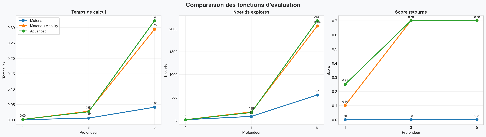
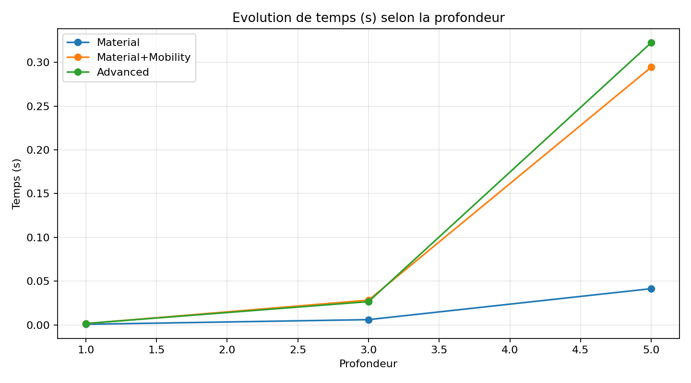
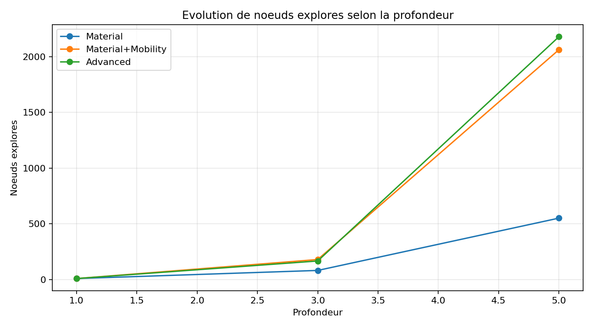
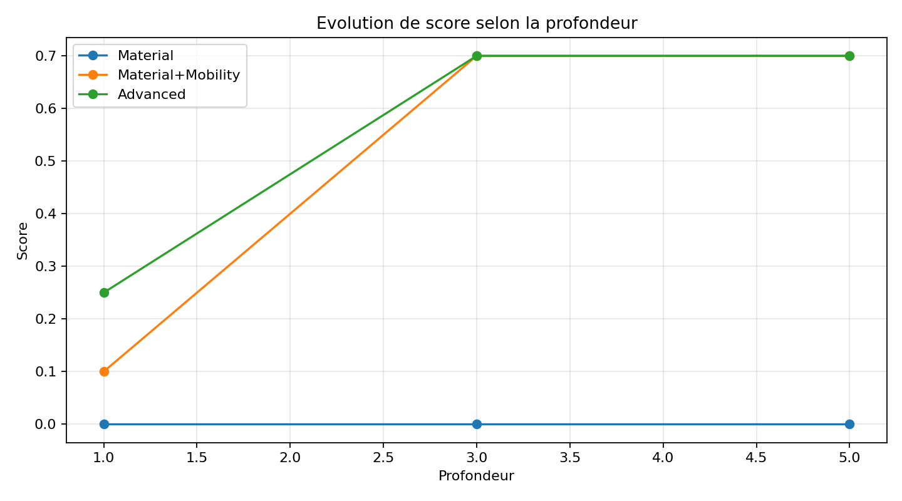
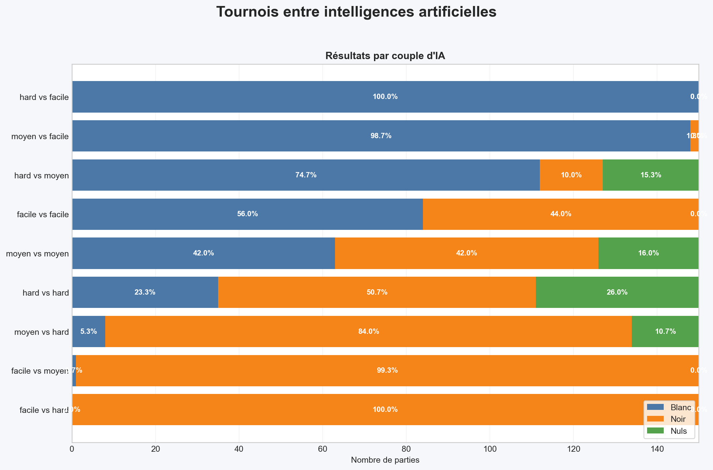

# 🎮 JEU DE DAMES - Rapport de Projet

## 5. Analyse du moteur, de l'IA et des tournois

### 5.1 Présentation générale du jeu

Le projet implémente une version classique du « jeu de dames » sur un damier 8×8. Les pièces occupent uniquement les cases jouables (diagonales sombres). Chaque joueur débute avec 12 pions disposés sur les trois premières rangées de son camp.

Règles principales implémentées
- Déplacement : les pions se déplacent d'une case en diagonale vers l'avant (selon leur couleur). Les dames (rois) se déplacent en diagonale et peuvent parcourir plusieurs cases (mouvement long, type « flying king »).
- Capture : la capture est obligatoire si au moins une prise est possible. Les prises multiples (séquences de sauts) sont gérées récursivement et retournées comme coups distincts.
- Promotion : un pion atteint la dernière rangée adverse et est automatiquement promu en dame.
- Conditions de fin : une partie se termine lorsqu'un joueur n'a plus de pièces actives ou n'a aucun coup légal. Dans ces cas, l'adversaire est déclaré gagnant.
- Nulle : une partie est nulle si 20 coups consécutifs sont joués sans capture , ou si les deux joueurs répètent la même position 5 fois.

### 5.2 Implementation et validation du moteur de jeu

Résumé des choix d'implémentation
- Représentation de l'état: le moteur expose les classes `Board`, `Move` et `GameState` (fichiers clés: `models/board.py`, `models/move.py`, `models/game_state.py`). Le `Board` contient une grille 8×8 (`grid`), l'occupation des cases via `CellState` et le champ `current_player`.
- Représentation d'un coup: la classe `Move` stocke un `path` (liste de positions), un ensemble `captured_positions` et des indicateurs `is_capture` / `is_promotion` selon la nature du coup.
- Génération des coups: `GameState.generate_legal_moves()` orchestre la génération en deux étapes:
    - Recherche de toutes les prises via `_generate_capture_moves()` et `_find_capture_sequences()`; si au moins une prise existe, seules les prises sont retournées (règle: capture obligatoire).
    - Sinon, génération des déplacements simples via `_generate_simple_moves()` (pions: une case en diagonale selon le sens; dames: exploration des diagonales tant que la case suivante est libre).
- Application d'un coup: `Board.apply_move(move)` met à jour la grille (déplacement de la pièce, suppression des pièces capturées, promotion si nécessaire) puis bascule `current_player`.
- Détection des états terminaux: `GameState.is_game_over()` et `GameState.get_winner()` utilisent:
    - l'absence de pièces ou de coups légaux pour déterminer la fin de partie;
    - une règle de nulle basée sur un compteur de coups sans capture (implémentation accessible dans `models/game_state.py`).

Validation et tests unitaires
- Le projet inclut une suite de tests dans `tests/test_game.py` qui vérifie les aspects critiques du moteur (initialisation du plateau, génération des coups, capture obligatoire, promotion, transitions d'état, évaluateurs et algorithmes de recherche). La suite contient actuellement 14 tests unitaires et passe sur la machine de développement.

Bonnes pratiques de test à inclure dans le rapport
- Présenter un ou deux tests représentatifs (ex.: capture obligatoire et promotion). Coller un extrait de `tests/test_game.py` montre la correspondance directe entre règle et test.
- Expliquer les invariants vérifiés: conservation du nombre total de pièces (après déplacement), changement de camp, non-corruption du plateau.
- Mesurer les performances de génération (nombre de coups générés, temps) sur une position statique pour justifier les optimisations (tri des coups avant exploration, clonage minimal).

### 5.3 Fonctions d'evaluation, score et elagage alpha-beta

Trois fonctions d'evaluation sont implementees. Elles retournent un score du point de vue du joueur MAX (joueur courant) :

- score positif : position favorable a MAX ;
- score negatif : position favorable a MIN ;
- score proche de 0 : position globalement equilibree.

Description des evaluateurs utilises :

| Evaluateur | Criteres utilises | Calcul du score | Interpretation |
|---|---|---|---|
| Material | Valeur des pieces | somme(MAX) - somme(MIN), avec pion = 1 et dame = 5 | avantage materiel pur |
| Material+Mobility | Materiel + mobilite | score materiel + 0.1 x (coups_MAX - coups_MIN) | avantage materiel et activite |
| Advanced | Materiel + mobilite + position | Material+Mobility + bonus (centre, menace de promotion, defense de rangee) | avantage strategique plus fin |

Integration dans Minimax et Alpha-Beta :

- a chaque feuille (profondeur 0) ou etat terminal, la fonction d'evaluation calcule le score ;
- Minimax propage ce score en alternant max et min selon le joueur ;
- Alpha-Beta applique la meme logique mais avec bornes alpha et beta pour couper des branches ;
- le tri des coups est active avant l'exploration (captures, puis promotions), ce qui augmente l'efficacite des coupures.

Dans la configuration du projet :

- IA facile : Minimax, profondeur 1, evaluateur Material ;
- IA moyenne : Alpha-Beta, profondeur 3, evaluateur Material+Mobility ;
- IA difficile : Alpha-Beta, profondeur 5, evaluateur Advanced.

Analyse experimentale (plateau initial, alpha-beta, profondeurs 1, 3 et 5) :

| Evaluateur | Profondeur | Score | Noeuds explores | Temps (s) |
|---|---:|---:|---:|---:|
| Material | 1 | -0.0 | 8 | 0.0007 |
| Material | 3 | -0.0 | 81 | 0.0060 |
| Material | 5 | -0.0 | 551 | 0.0414 |
| Material+Mobility | 1 | 0.1 | 8 | 0.0015 |
| Material+Mobility | 3 | 0.7 | 179 | 0.0283 |
| Material+Mobility | 5 | 0.7 | 2064 | 0.2945 |
| Advanced | 1 | 0.25 | 8 | 0.0016 |
| Advanced | 3 | 0.7 | 166 | 0.0266 |
| Advanced | 5 | 0.7 | 2181 | 0.3225 |

Figures (mesures selon la profondeur) :

Discussion de l'interaction avec l'elagage alpha-beta :

- Impact du tri des coups : en explorant d'abord les coups prometteurs (captures et promotions), les bornes alpha/beta se resserrent plus vite ;
- Impact sur les noeuds explores : quand la profondeur augmente, tous les evaluateurs explorent plus de noeuds, mais la croissance est plus marquee avec des evaluateurs plus riches (car l'ordre des coups et la structure des branches changent) ;
- Impact sur le temps : le temps suit la croissance des noeuds explores ; l'evaluateur Advanced est le plus couteux, mais apporte une evaluation strategique plus fine ;
- Profondeur effectivement atteinte : dans cette implementation, la profondeur cible est atteinte hors arret terminal precoce, et la statistique `depth_reached` est renseignee a la profondeur demandee dans la recherche.

Conclusion 5.3 : les trois fonctions sont complementaires. Material est rapide et stable, Material+Mobility introduit un meilleur sens de l'activite, et Advanced donne le meilleur niveau strategique au prix d'un cout de calcul plus eleve. Les resultats confirment l'interet du couple "bon evaluateur + alpha-beta + tri des coups".

Le script de generation des tableaux/figures est fourni dans [scripts/benchmark_evaluators.py](scripts/benchmark_evaluators.py). Les sorties sont dans [docs/benchmarks/](docs/benchmarks/).

### 5.4 Tournoi entre les intelligences artificielles

Le tournoi a ete organise par couples de niveaux, avec 3 lots de 50 parties pour chaque configuration. Cela represente 150 parties par couple, ce qui permet d'obtenir une mesure plus robuste que sur une seule serie de 50 parties.

| Blanc | Noir | Lots | Victoires blanches moy. | Victoires noires moy. | Nuls moy. | Temps moyen (s) |
|---|---|---:|---:|---:|---:|---:|
| facile | facile | 3 | 28.0 | 22.0 | 0.0 | 0.44 |
| facile | hard | 3 | 0.0 | 50.0 | 0.0 | 35.99 |
| facile | moyen | 3 | 0.33 | 49.67 | 0.0 | 2.55 |
| hard | facile | 3 | 50.0 | 0.0 | 0.0 | 26.33 |
| hard | hard | 3 | 11.67 | 25.33 | 13.0 | 725.87 |
| hard | moyen | 3 | 37.33 | 5.0 | 7.67 | 261.78 |
| moyen | facile | 3 | 49.33 | 0.67 | 0.0 | 2.19 |
| moyen | hard | 3 | 2.67 | 42.0 | 5.33 | 159.43 |
| moyen | moyen | 3 | 21.0 | 21.0 | 8.0 | 9.41 |

Le graphe ci-dessous resume visuellement les victoires, defaites et nuls par couple d'IA.

Interpretation des resultats :

- Robustesse des resultats. Chaque couple est evalue sur 150 parties (3 lots de 50), ce qui reduit fortement l'effet d'une serie atypique. Les tendances fortes restent stables d'un lot a l'autre : hard domine facile, moyen domine facile, et hard domine moyen dans les deux sens de confrontation.

- Influence du hasard. Le moteur introduit une part de variabilite via le choix aleatoire parmi plusieurs meilleurs coups de meme score. Cette variabilite est visible surtout dans les confrontations proches (moyen vs moyen, hard vs hard), ou la proportion de nuls augmente et ou les ecarts de victoires sont moins extremes. Le hasard influence donc le detail des scores, mais pas la hierarchie globale des niveaux.

- Influence du joueur qui commence. L'avantage du premier joueur existe dans certains cas, mais il n'est pas universel. Exemple en miroir : facile vs moyen (blanc facile) donne un taux de victoire blanc tres faible, alors que moyen vs facile (blanc moyen) donne un taux de victoire blanc tres eleve. Cela montre que l'effet du niveau de l'IA est plus fort que l'effet du trait (jouer en premier). Sur les duels de meme niveau (facile vs facile, moyen vs moyen, hard vs hard), on observe des ecarts plus moderes et davantage de nuls, ce qui est coherent avec des affrontements plus equilibres.

- Justification generale. Les resultats sont coherents avec la construction des IA : profondeur de recherche plus elevee, evaluateur plus riche et alpha-beta avec tri des coups pour les niveaux superieurs. Les performances observees en tournoi confirment donc les choix algorithmiques presentes dans la section precedente.

Ces resultats montrent que l'augmentation du niveau d'IA produit bien une difference tangible de performance. Ils montrent aussi que les configurations symetriques ne donnent pas toujours des resultats parfaitement equilibres, ce qui justifie de travailler par lots de parties et d'agréger les statistiques.

Le fichier de synthese est genere a partir de [tournaments/tournament_summary.csv](tournaments/tournament_summary.csv) via le script [scripts/summarize_tournaments.py](scripts/summarize_tournaments.py). Le resume produit est stocke dans [docs/benchmarks/tournament_summary.md](docs/benchmarks/tournament_summary.md).

